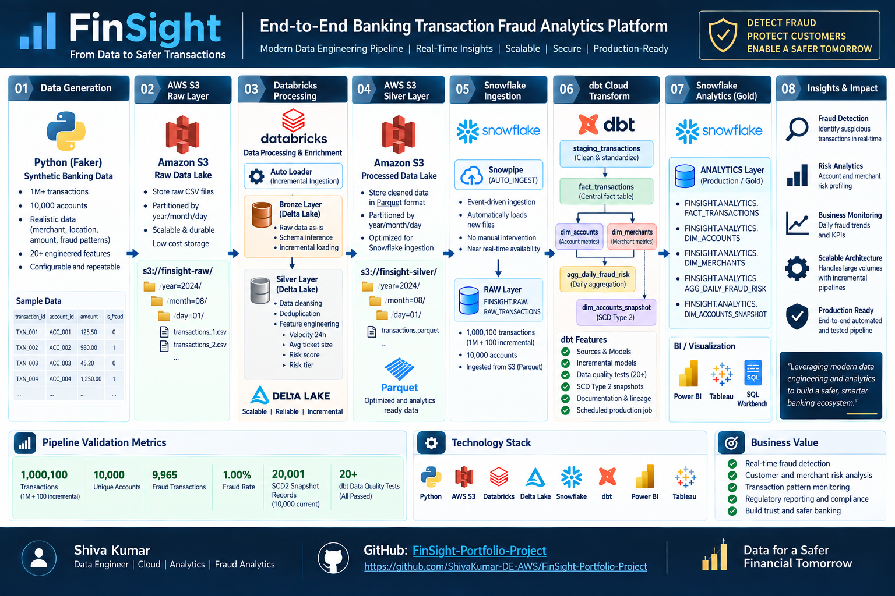

# FinSight — Banking Transaction Analytics & Fraud Risk Pipeline

An end-to-end cloud data engineering and analytics platform that ingests,
processes, transforms, and analyzes banking transactions to identify fraud
patterns and generate account, merchant, and daily risk insights.

## 🚀 Project Overview

FinSight demonstrates a production-style data engineering pipeline using
AWS S3, Databricks, Snowflake, Snowpipe, and dbt Cloud.

The pipeline supports incremental transaction ingestion, data cleansing,
feature engineering, automated Snowflake ingestion, dimensional analytics,
SCD Type 2 history tracking, and automated data-quality validation.

---

## 🏗️ Architecture




```text
Python / Faker
      |
      v
AWS S3 - RAW
      |
      | Databricks Auto Loader
      v
Databricks Bronze - Delta Lake
      |
      | foreachBatch
      v
Databricks Silver - Delta Lake
      |
      | Parquet
      v
AWS S3 - Silver
      |
      | Snowpipe AUTO_INGEST
      v
Snowflake RAW
      |
      | dbt Cloud
      v
+-------------------------------+
| staging_transactions          |
+---------------+---------------+
                |
                v
       fact_transactions
          /           \
         v             v
 dim_accounts     dim_merchants
         \             /
          \           /
           v         v
       agg_daily_fraud_risk

dim_accounts
      |
      v
dim_accounts_snapshot
      |
      v
    SCD Type 2

Snowflake ANALYTICS
      |
      v
BI / Analytics

## 🗂️ Project Structure

```text
FinSight-Portfolio-Project/
│
├── models/
│   ├── sources.yml
│   ├── schema.yml
│   │
│   ├── staging/
│   │   └── staging_transactions.sql
│   │
│   └── marts/
│       ├── fact_transactions.sql
│       ├── dim_accounts.sql
│       ├── dim_merchants.sql
│       └── agg_daily_fraud_risk.sql
│
├── snapshots/
│   └── dim_accounts_snapshot.sql
│
├── tests/
│   ├── valid_fraud_flag.sql
│   └── positive_transaction_amount.sql
│
├── macros/
├── analyses/
├── seeds/
├── Tests/
│
├── dbt_project.yml
├── .gitignore
└── README.md
